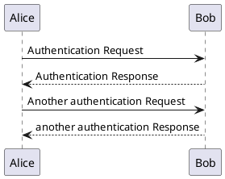

> Экзамен. Явно переволновавшийся студент спрашивает:  
> — А писло чесать?  
> Препод:  
> — Чешите, если поможет…

## Структура экзамена

Перед теоретическими вопросами вам будет предоставлена 1 задача. После ознакомления вы будете приглашены по очереди на сдачу теории. 
Перед и после сдачи теории можно спокойно решать задачу. Как задача будет решена, присылайте на почту, крайний срок сдачи 19:15.

## Задача

Требуется решить простую задачу на алгоритмизацию. Требуется посчитать количество нулей, единиц и двоек в троичном представлении числа. 
Использовать готовые функции и строковые операции запрещено. В случае, если число не имеет хотя бы одного нуля или единицы или двойки, то требуется
вызвать ошибку (`raise`).

```python
def solution(x):
    count_0 = 0
    count_1 = 0
    count_2 = 0
    
    # do smth with x
    
    return count_0, count_1, count_2
```

Вторая часть задачи основывается на описании данного алгоритма, раз запрограммировать смогли, то и описать алгоритм получится. Описывать придется
с использованием [PlantUML](https://plantuml.com/en/), для этого просмотрите [документацию](https://pdf.plantuml.net/PlantUML_Language_Reference_Guide_ru.pdf).
Выберите наиболее подходящую диаграмму, опишите его кодом, затем отрисуйте и пришлите картинку. Блок вызова ошибки на диаграмме должен быть любого красного цвета. 

Пример кода диаграммы:




Редактор можно найти в интернете, или [тут](https://www.planttext.com/).

### Краткое описание задачи

1. Решить задачу по поиску количества нулей, единиц и двоек в троичном представлении числа `x`.
2. Решение записать в функцию `solution`.
3. Внутри функции вызвать ошибку, если число `x` не имеет одного нуля или одной единицы или одной двойки в троичном представлении.
4. Изучить нотацию PlantUML.
5. Выбрать подходящую диаграмму.
6. Написать код диаграммы и сгенерировать картинку, блок вызова ошибки на диаграмме должен быть любого красного цвета. 
7. Создать `.md` отчет с всеми этапами и прислать на почту (картинку приложить отдельно, как и весь код).

## Теория и вопросы

В каждом пункте указана тема, которую требуется раскрыть. А также вопросы, на которые нужно обязательно дать ответ.

1. Алгоритмы. Что такое алгоритм? Из чего состоит алгоритм?
2. Алгоритмы. Какие существуют команды и конструкции алгоритмов?
3. Сложность алгоритма. Что такое сложность алгоритма и что значит асимптотическая сложность?
4. Сложность алгоритма. Какие операции можно проводить со сложностью алгоритма?
5. Способ обработки алгоритма. Как компьютер понимает код? Что позволяет это сделать и как?
6. Оптимизация алгоритмов. Зачем нужна оптимизация?
7. Оптимизация алгоритмов по времени. Какие есть способы оптимизации?
8. Оптимизация алгоритмов по памяти. Какие есть способы оптимизации?
9. Данные и структуры. Как можно представить данные? Какие есть структуры для хранения информации?
10. Языки программирования. Что такое программирование? Из чего состоит язык программирования?
11. Языки программирования. Зачем классифицировать языки программирования? Какие существуют способы классификации?
12. Языки программирования. Что такое парадигма программирования? Какие существуют парадигмы?
13. Объектно-ориентированное программирование. Что такое ООП? Зачем нужно ООП? Какие основные понятия существуют в ООП?
14. Информационное моделирование. Что такое модель? Что позволяет сделать информационное моделирование? Какие виды моделирования существуют?
15. Жизненный цикл программного обеспечения. Что это такое, из чего состоит и зачем нужная каждая часть?
16. Методологии разработки. Что это такое, какие существуют и зачем нужны?

**Удачи!**